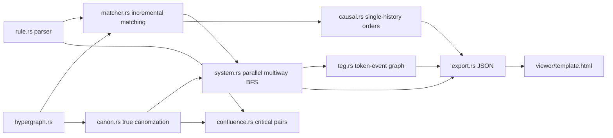

# multiway

Multiway hypergraph rewriting with e-graph-style state sharing.
**Zero dependencies. Deterministic to the byte. Ships its own interactive viewer.**

[](https://github.com/sjqtentacles/multiway/actions/workflows/ci.yml)
[](LICENSE)
[](Cargo.toml)
[](Cargo.toml)

<picture>
  <source media="(prefers-color-scheme: dark)" srcset="docs/multiway-dark.png">
  
</picture>

States are hypergraphs — multisets of ordered hyperedges over integer
vertices — defined *up to isomorphism*. Rules rewrite sub-hypergraphs,
Wolfram-model style. The engine explores **every** possible rewrite, but
instead of building the naive evolution tree it assigns every state a
true canonical form and merges globally, producing a compressed DAG.
That is the e-graph move (equality saturation's sharing) applied at
state granularity.

The compression is not cosmetic. The classic Wolfram-model rule
`{{x,y},{x,z}} -> {{x,z},{x,w},{y,w},{z,w}}` from `{{0,0},{0,0}}`:

| depth | naive tree nodes | canonical states | sharing |
|------:|-----------------:|-----------------:|--------:|
| 0     | 1                | 1                | 1.0×    |
| 1     | 2                | 1                | 2.0×    |
| 2     | 24               | 3                | 8.0×    |
| 3     | 408              | 18               | 22.7×   |
| 4     | 9,504            | 156              | 60.9×   |
| 5     | 280,080          | 1,776            | 157.7×  |

Depth 5 — over a quarter million tree nodes collapsed to 1,776 states —
runs in ~0.1 s (~40 ms with `--threads 4`). The sharing factor *grows*
with depth, which is the whole argument for building on this
representation. Every number in that table is an executable test.

## Quick start

```sh
cargo test                    # the whole suite, incl. hand-verified counts
cargo run --release -- \
  --rule "{{x,y},{x,z}}->{{x,z},{x,w},{y,w},{z,w}}" \
  --init "{{0,0},{0,0}}" \
  --steps 4 --causal 40 \
  --html demo.html
open demo.html                # interactive multiway + causal + token-event explorer

# analysis modes
cargo run --release -- --lint --rule "{{x,y},{y,z}}->{{x,z}}"
cargo run --release -- --check-confluence \
  --rule "{{x,y}}->{{x}}" --rule "{{x,y}}->{}"

# as a library
cargo run --example basic_evolution
```

The viewer is a single self-contained HTML file (data baked in, no CDN,
no network): layered multiway graph with branchial pairs and an
evolution scrubber, the token-event causal graph across all updating
orders, a single-history causal DAG, and a per-state hypergraph
inspector. Light and dark mode, touch and keyboard, PNG export.

## Rule gallery

| rule | init | story |
|---|---|---|
| `{{x,y}}->{{x,y},{y,z}}` | `{{0,0}}` | minimal growth; hand-verified layers [1,1,2,4] |
| `{{x,y},{x,z}}->{{x,z},{x,w},{y,w},{z,w}}` | `{{0,0},{0,0}}` | the classic 2→4 from the Wolfram Physics Project; the flagship sharing numbers above |
| `{{x,y},{y,z}}->{{x,z}}` | `{{0,1},{1,2},{2,3},{3,0}}` | **terminating**: every event removes an edge; the final state provably has no matches |
| `{{x,y}}->{{y,x}}` | `{{0,1},{1,2}}` | **back-merge demo**: reversal is period-2, states recur across steps (`back-merges 4`), and the CLI honestly suppresses the now-meaningless naive-tree columns |
| `{{x,y,z}}->{{x,y,w},{y,w,z}}` | `{{0,0,0}}` | ternary hyperedges are first-class; layers [1,1,2,5] |
| `{{x,y}}->{{x,z},{z,y}}` | `{{0,0}}` | edge subdivision: maximal sharing — k! naive nodes per layer collapse to **one** canonical state |
| `{{x,y},{x,y}}->{{x,y}}` | — | checker demo: all 5 critical pairs strongly joinable + strictly edge-decreasing ⇒ **confluent: YES** (Newman) |
| `{{x,y}}->{{x}}` + `{{x,y}}->{}` | — | checker demo: genuine counterexample — host `{{0,1}}` diverges to `{{0}}` vs `{}`, both saturated, disjoint ⇒ **NOT CONFLUENT** |

Every row's numbers and verdicts are locked by `tests/gallery.rs`.

## How it works

**True canonization** (`canon`). Every state gets a canonical *form* via
nauty-style individualization–refinement adapted to ordered multiset
hyperedges: exact rank-normalized refinement classes (identity never
touches a hash), smallest-cell branching, minimal-leaf selection. Equal
forms ⟺ isomorphic — so multiway dedup is a single map lookup, no
bucket scans, no in-loop isomorphism checks. The v0.1 two-tier scheme
(WL-invariant hash + exact backtracking check) survives as test oracles,
fuzzed against a brute-force all-bijections oracle.

**Matching** (`matcher`) is backtracking sub-hypergraph matching with
Wolfram-model semantics: distinct pattern variables may bind the same
vertex; each pattern edge consumes a distinct edge instance; RHS-only
variables mint fresh vertices. Match sets are **delta-maintained**
across events — survivors plus matches seeded through freshly produced
edges — reproducing the full search byte-exactly (one full search per
run, ever).

**Multiway evolution** (`system`) is BFS with global canonical dedup,
optionally parallel (`--threads N`): pure per-child work fans out across
scoped threads, bookkeeping replays serially in index order, so output
is byte-identical for every thread count *by construction*. Each layer
records branchial pairs; `path_counts` is the DP that answers "how many
naive tree nodes does this canonical state absorb?".

**Token-event graph** (`teg`). Edge instances get identity
`(state, canonical slot)` through each state's canonization witness, so
causal structure is computed across **all** updating orders on the
merged DAG — creator sets are honestly path-dependent, cyclic merges
(an event class causally preceding itself across histories) included.
Single-history causal graphs (`causal`) come in sequential and
standard-updating-order (maximal disjoint generations) flavors.

**Confluence checker** (`confluence`). Critical pairs by unifying LHS
overlaps, then bounded **strong** joinability — branches deduplicated by
colored canonical forms with pinned host vertices, because plain
joinable-up-to-isomorphism provably does not survive contexts. The
verdicts only ever claim what was established:
`AllCriticalPairsStronglyJoinable` (evidence), `confluent: true` only
with the termination lint (Newman), `NotConfluent` only on a doubly
saturated disjoint divergence, `Inconclusive` otherwise — bound hits are
never counterexamples. See [docs/THEORY.md](docs/THEORY.md) for exactly
what each verdict means and why.

**No global RNG, no wall clock.** Hashes are deterministic, fresh
vertices are counter-minted, maps that could leak iteration order use a
fixed-seed hasher, and even the viewer's force layout is seeded
arithmetically — identical inputs give identical outputs everywhere.
The committed golden files passing on Linux/macOS/Windows in CI are the
cross-platform proof.

## Architecture



## Layout

```
src/hypergraph.rs   states and ordered hyperedges
src/det.rs          determinism primitives: mixing fn, DetMap, seeded PRNG
src/canon.rs        true canonization (IR search) + WL hash / exact iso as oracles
src/rule.rs         parser + printers for {{x,y},{x,z}} -> {...} notation
src/matcher.rs      backtracking + incremental matching, rule application
src/system.rs       multiway BFS, canonical dedup, branchial, paths, parallel
src/teg.rs          token-event graph across all updating orders
src/causal.rs       single-history evolution: sequential + standard order
src/confluence.rs   critical pairs + strong joinability checker
src/lint.rs         static rule analysis (conservation, termination)
src/export.rs       JSON bundling (handwritten, zero deps)
src/report.rs       deterministic stats rendering (golden-locked)
src/stats.rs        box tables, sparklines, digit grouping
src/main.rs         CLI; bakes data into viewer/template.html
src/bin/bench.rs    zero-dep benchmark harness
viewer/template.html  self-contained interactive explorer
tests/              baseline pins, property suites, oracles, goldens
docs/THEORY.md      what the algorithms claim, and exactly what they don't
```

## Theory & references

- **Wolfram Physics Project** — S. Wolfram, *A Class of Models with the
  Potential to Represent Fundamental Physics* (Complex Systems 29(2),
  2020): the multiway/branchial/causal-invariance program.
- **egg** — Willsey et al., *Fast and Extensible Equality Saturation*
  (POPL 2021): the sharing discipline this engine applies at state
  granularity.
- **Weisfeiler–Leman (1968)**: color refinement — the refinement pass
  inside canonization, adapted to ordered hyperedges.
- **nauty/Traces** — McKay & Piperno, *Practical Graph Isomorphism, II*
  (JSC 2014): the individualization–refinement playbook.
- **Knuth–Bendix (1970)**: critical pairs.
- **Plump** (1993, 2005): strong joinability for (hyper)graph rewriting,
  and undecidability of confluence — why the checker's verdicts are
  worded the way they are.

The deep-dive lives in [docs/THEORY.md](docs/THEORY.md).

## Roadmap

- [x] Canonical dedup — state-level e-graph sharing
- [x] True canonization — canonical *forms* via individualization–refinement
- [x] Token-event graph — causal structure across all updating orders
- [x] Causal-invariance checker — critical pairs, strong joinability, honest verdicts
- [x] Incremental matching — delta-maintained match sets
- [x] Parallel rewriting — deterministic-by-construction threading + standard updating order
- [x] Rule lint — conservation/termination checks (the v0 of a typed rule layer)
- [ ] Sub-state sharing — the actual e-graph: share sub-hypergraphs *across* states (egglog-style relational substrate)
- [ ] Automorphism pruning + orbit-true token identity (canonization V2)
- [ ] Critical-pair lemma proof note for this formalism
- [ ] WASM playground — the engine in the browser, hand-rolled ABI, still zero deps
- [ ] Typed rule layer — conservation laws as compile-time guarantees

## License

MIT — see [LICENSE](LICENSE).
