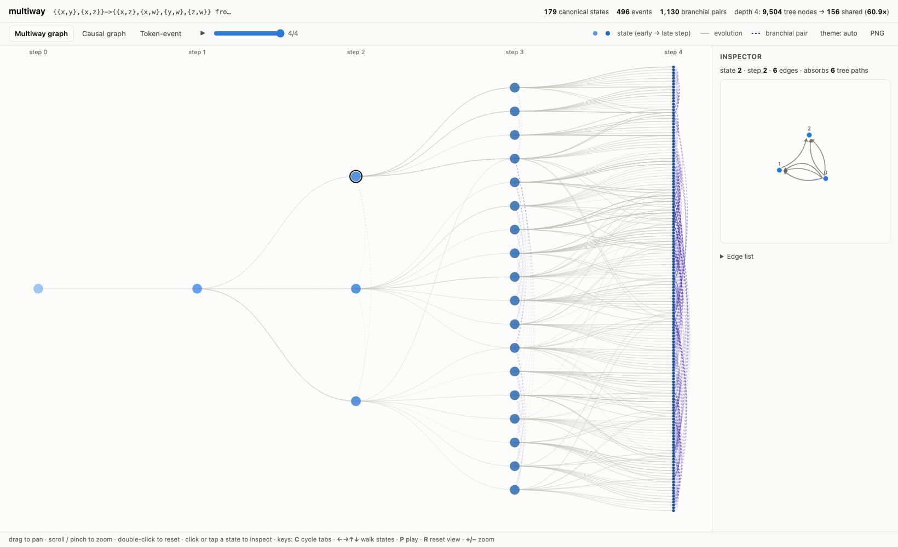
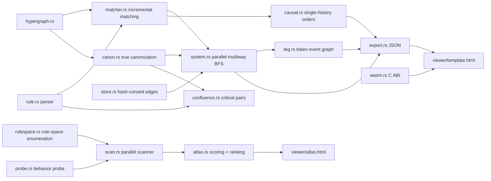

# multiway

Multiway hypergraph rewriting with e-graph-style state sharing — plus a
scanner that **discovers interesting rules by itself**.
**Zero dependencies. Deterministic to the byte. Runs in your terminal and your browser.**

[](https://github.com/sjqtentacles/multiway/actions/workflows/ci.yml)
[](LICENSE)
[](Cargo.toml)
[](Cargo.toml)
[](https://sjqtentacles.github.io/multiway/)

**▶ [Try it live](https://sjqtentacles.github.io/multiway/)** — the full
engine compiled to WebAssembly (131 KB), running in your browser tab,
producing output **byte-identical** to the native CLI. Or browse a
[baked rule atlas](https://sjqtentacles.github.io/multiway/atlas/) the
scanner discovered.

<picture>
  <source media="(prefers-color-scheme: dark)" srcset="docs/multiway-dark.png">
  
</picture>

States are hypergraphs — multisets of ordered hyperedges over integer
vertices — defined *up to isomorphism*. Rules rewrite sub-hypergraphs,
Wolfram-model style. The engine explores **every** possible rewrite, but
instead of building the naive evolution tree it assigns every state a
true canonical form and merges globally, producing a compressed DAG.
That is the e-graph move (equality saturation's sharing) applied at
state granularity.

The compression is not cosmetic. The classic Wolfram-model rule
`{{x,y},{x,z}} -> {{x,z},{x,w},{y,w},{z,w}}` from `{{0,0},{0,0}}`:

| depth | naive tree nodes | canonical states | sharing |
|------:|-----------------:|-----------------:|--------:|
| 0     | 1                | 1                | 1.0×    |
| 1     | 2                | 1                | 2.0×    |
| 2     | 24               | 3                | 8.0×    |
| 3     | 408              | 18               | 22.7×   |
| 4     | 9,504            | 156              | 60.9×   |
| 5     | 280,080          | 1,776            | 157.7×  |
| 6     | 10,019,568       | 24,718           | 405.4×  |
| 7     | 422,553,936      | 397,302          | 1063.6× |

Depth 5 runs in ~70 ms. Depth 6 — ten million naive nodes — in ~2.9 s
serial, ~2.1 s with `--threads 4`, inside ~300 MB. Depth 7 collapses
**422 million** naive tree nodes into 423,975 canonical states in about
five minutes and 2.5 GB, on a laptop, with `back-merges 0` verifying
the count. The sharing factor *grows* with depth, which is the whole
argument for building on this representation. Every number through
depth 6 is an executable test.

## Quick start

```sh
cargo test                    # the whole suite, incl. hand-verified counts
cargo run --release -- \
  --rule "{{x,y},{x,z}}->{{x,z},{x,w},{y,w},{z,w}}" \
  --init "{{0,0},{0,0}}" \
  --steps 4 --causal 40 \
  --html demo.html
open demo.html                # interactive multiway + causal + token-event explorer

# discover interesting rules instead of guessing them
cargo run --release -- --scan --top 15 --threads 4 --atlas atlas/
open atlas/index.html

# terminal-native output
cargo run --release -- --rule "{{x,y}}->{{x,y},{y,z}}" --init "{{0,0}}" \
  --steps 3 --ascii

# analysis modes
cargo run --release -- --lint --rule "{{x,y},{y,z}}->{{x,z}}"
cargo run --release -- --check-confluence \
  --rule "{{x,y}}->{{x}}" --rule "{{x,y}}->{}"

# as a library
cargo run --example basic_evolution
```

The viewer is a single self-contained HTML file (data baked in, no CDN,
no network): layered multiway graph with branchial pairs and an
evolution scrubber, the token-event causal graph across all updating
orders, a single-history causal DAG, and a per-state hypergraph
inspector. Light and dark mode, touch and keyboard, PNG export.

## Pattern discovery — the scanner

You don't have to guess which rules are interesting. The scanner
enumerates an entire rule space *modulo behavioral equivalence*
(variable renaming + edge permutations, counted exactly via Burnside's
lemma), probes every class under strict count-based budgets, classifies
growth (dies / static / periodic / linear / poly / exp), detects
periods, fingerprints evolutions, and ranks by an all-integer
interestingness score:

```
$ multiway --scan --max-lhs 1 --max-rhs 2 --max-vars 3 --top 5
multiway atlas — top 5 of 193 rule classes
┌─────┬────────┬────┬──────────────────────────┬─────────────┬──────────┬──────────────┐
│   # │  score │  × │ rule                     │ growth      │ layers   │ confluence   │
├─────┼────────┼────┼──────────────────────────┼─────────────┼──────────┼──────────────┤
│   1 │  7,127 │  1 │ {{a,b}}->{{b,c},{c,a}}   │ pol/exp/sta │ ▁▁▄█     │ confluent    │
│   2 │  6,627 │  1 │ {{a,b}}->{{a,c},{c,b}}   │ sta/sta/pol │ ▁▁██     │ confluent    │
│   3 │  6,627 │  1 │ {{a,b}}->{{b,a},{c,c}}   │ sta/sta/pol │ ▁▁██     │ confluent    │
```

- `--count` prints the exact class count instantly (the default space
  has **18,143** classes; arity ≤ 3 has **16,184,498** — computed by
  Burnside, cross-checked against explicit enumeration in the tests).
- Exhaustive scans refuse spaces beyond 200k classes with the exact
  size — use `--sample N --seed 0xHEX` for a deterministic subset.
- `--atlas DIR` bakes a self-contained HTML index **plus a full
  interactive viewer per discovered rule**; `--scan-json` exports
  everything.
- Same flags ⇒ byte-identical output, **for any `--threads N`**.

Honesty notes are part of the design: a budget-hit is labeled
`budget-hit`, never "chaotic"; scores are a documented heuristic with
pinned reference values, not an objective measure; per-seed
classifications are never averaged (seed disagreement is itself
signal).

## The playground

[**sjqtentacles.github.io/multiway**](https://sjqtentacles.github.io/multiway/)
is the same viewer with the engine baked in as a 131 KB WebAssembly
module (hand-rolled C ABI — still zero dependencies, no wasm-bindgen).
Type a rule, hit Run. The "copy bundle JSON" button gives you bytes you
can `cmp` against the native CLI's `--json` — and CI mechanically
verifies that byte-identity across the architecture boundary on every
push. Build it yourself:

```sh
rustup target add wasm32-unknown-unknown
cargo rustc --lib --profile wasm --target wasm32-unknown-unknown --crate-type cdylib
cargo run --release -- --playground playground.html \
  --wasm target/wasm32-unknown-unknown/wasm/multiway.wasm
```

(Also available as a CI artifact on every push, and auto-deployed to
Pages from `main`.)

## Rule gallery

| rule | init | story |
|---|---|---|
| `{{x,y}}->{{x,y},{y,z}}` | `{{0,0}}` | minimal growth; hand-verified layers [1,1,2,4] |
| `{{x,y},{x,z}}->{{x,z},{x,w},{y,w},{z,w}}` | `{{0,0},{0,0}}` | the classic 2→4 from the Wolfram Physics Project; the flagship sharing numbers above |
| `{{x,y},{y,z}}->{{x,z}}` | `{{0,1},{1,2},{2,3},{3,0}}` | **terminating**: every event removes an edge; the final state provably has no matches |
| `{{x,y}}->{{y,x}}` | `{{0,1},{1,2}}` | **back-merge demo**: reversal is period-2, states recur across steps (`back-merges 4`), and the CLI honestly suppresses the now-meaningless naive-tree columns |
| `{{x,y,z}}->{{x,y,w},{y,w,z}}` | `{{0,0,0}}` | ternary hyperedges are first-class; layers [1,1,2,5] |
| `{{x,y}}->{{x,z},{z,y}}` | `{{0,0}}` | edge subdivision: maximal sharing — k! naive nodes per layer collapse to **one** canonical state |
| `{{a,b}}->{{b,c},{c,a}}` | *(scanner seed)* | **found by `--scan`**: rotate-and-grow, top of the 193-class atlas — poly growth on loops, exponential on paths |
| `{{x,y},{x,y}}->{{x,y}}` | — | checker demo: all 5 critical pairs strongly joinable + strictly edge-decreasing ⇒ **confluent: YES** (Newman) |
| `{{x,y}}->{{x}}` + `{{x,y}}->{}` | — | checker demo: genuine counterexample — host `{{0,1}}` diverges to `{{0}}` vs `{}`, both saturated, disjoint ⇒ **NOT CONFLUENT** |

Every gallery row's numbers and verdicts are locked by `tests/gallery.rs`;
the scanner row is pinned by the scan goldens.

## How it works

**True canonization** (`canon`). Every state gets a canonical *form* via
nauty-style individualization–refinement adapted to ordered multiset
hyperedges: exact rank-normalized refinement classes (identity never
touches a hash), smallest-cell branching, minimal-leaf selection, and
**automorphism pruning** — equal-key leaves yield generators whose
orbits prune the search, byte-identical forms guaranteed by the
first-found-wins tie rule. Equal forms ⟺ isomorphic — so multiway dedup
is a single map lookup, no bucket scans, no in-loop isomorphism checks.

**Matching** (`matcher`) is backtracking sub-hypergraph matching with
Wolfram-model semantics: distinct pattern variables may bind the same
vertex; each pattern edge consumes a distinct edge instance; RHS-only
variables mint fresh vertices. Match sets are **delta-maintained**
across events — survivors plus matches seeded through freshly produced
edges — reproducing the full search byte-exactly (one full search per
run, ever).

**Multiway evolution** (`system`) is BFS with global canonical dedup,
optionally parallel (`--threads N`): pure per-child work fans out across
scoped threads, bookkeeping replays serially in index order, so output
is byte-identical for every thread count *by construction*. Canonical
forms are **hash-consed** through an edge store (`store`) — dedup keys
are id vectors, not edge lists. `path_counts` is the DP that answers
"how many naive tree nodes does this canonical state absorb?";
branchial pairs derive lazily from the event list.

**Token-event graph** (`teg`). Edge instances get identity
`(state, canonical slot)` through each state's canonization witness, so
causal structure is computed across **all** updating orders on the
merged DAG — creator sets are honestly path-dependent (multivalued
creators are exported and annotated in the viewer), cyclic merges
included. Single-history causal graphs (`causal`) come in sequential
and standard-updating-order flavors.

**Confluence checker** (`confluence`). Critical pairs by unifying LHS
overlaps, then bounded **strong** joinability — branches deduplicated by
colored canonical forms with pinned host vertices, because plain
joinable-up-to-isomorphism provably does not survive contexts. The
verdicts only ever claim what was established:
`AllCriticalPairsStronglyJoinable` (evidence), `confluent: true` only
with the termination lint (Newman), `NotConfluent` only on a doubly
saturated disjoint divergence, `Inconclusive` otherwise — bound hits are
never counterexamples. The critical-pair lemma for this exact formalism
is worked through in [docs/LEMMA.md](docs/LEMMA.md) — two steps proved
(one fuzz-pinned), one honest gap listed. See
[docs/THEORY.md](docs/THEORY.md) for exactly what each verdict means.

**No global RNG, no wall clock.** Hashes are deterministic, fresh
vertices are counter-minted, maps that could leak iteration order use a
fixed-seed hasher, every scan score is integer arithmetic in
milli-units, and even the viewer's force layout is seeded
arithmetically — identical inputs give identical outputs everywhere.
The committed golden files passing on Linux/macOS/Windows in CI are the
cross-platform proof; the node byte-identity check in the wasm CI job
extends it across CPU architectures.

## Architecture



## Layout

```
src/hypergraph.rs   states and ordered hyperedges
src/det.rs          determinism primitives: mixing fn, DetMap, PRNG, integer log2
src/canon.rs        true canonization (IR + automorphism pruning) + oracles
src/rule.rs         parser + printers for {{x,y},{x,z}} -> {...} notation
src/matcher.rs      backtracking + incremental matching, rule application
src/system.rs       multiway BFS, canonical dedup, paths, parallel phases
src/store.rs        hash-consed edge store (EdgeId interning)
src/teg.rs          token-event graph across all updating orders
src/causal.rs       single-history evolution: sequential + standard order
src/confluence.rs   critical pairs + strong joinability checker
src/lint.rs         static rule analysis (conservation, termination)
src/rulespace.rs    rule-space enumeration modulo equivalence (Burnside)
src/probe.rs        bounded deterministic behavior probe
src/atlas.rs        interestingness scoring, fingerprint dedup, ranking
src/scan.rs         thread-invariant parallel scan driver + renderers
src/ascii.rs        terminal DAG renderer (--ascii)
src/wasm.rs         run_json core + wasm32 C ABI shim
src/export.rs       JSON bundling (handwritten, zero deps)
src/report.rs       deterministic stats rendering (golden-locked)
src/stats.rs        box tables, sparklines, digit grouping
src/main.rs         CLI; bakes viewers, playground, and atlases
src/bin/bench.rs    zero-dep benchmark harness
viewer/template.html  self-contained explorer + wasm playground (dual-mode)
viewer/atlas.html     self-contained atlas index
tests/              baseline pins, property suites, oracles, goldens
docs/THEORY.md      what the algorithms claim, and exactly what they don't
docs/LEMMA.md       the critical-pair lemma: proofs, fuzz pins, the open gap
```

## Theory & references

- **Wolfram Physics Project** — S. Wolfram, *A Class of Models with the
  Potential to Represent Fundamental Physics* (Complex Systems 29(2),
  2020): the multiway/branchial/causal-invariance program.
- **egg** — Willsey et al., *Fast and Extensible Equality Saturation*
  (POPL 2021): the sharing discipline this engine applies at state
  granularity.
- **Weisfeiler–Leman (1968)**: color refinement — the refinement pass
  inside canonization, adapted to ordered hyperedges.
- **nauty/Traces** — McKay & Piperno, *Practical Graph Isomorphism, II*
  (JSC 2014): the individualization–refinement playbook, automorphism
  pruning included.
- **Burnside's lemma**: exact rule-class counting for the scanner.
- **Knuth–Bendix (1970)**: critical pairs.
- **Plump** (1993, 2005): strong joinability for (hyper)graph rewriting,
  and undecidability of confluence — why the checker's verdicts are
  worded the way they are.

The deep-dive lives in [docs/THEORY.md](docs/THEORY.md).

## Roadmap

- [x] Canonical dedup — state-level e-graph sharing
- [x] True canonization — canonical *forms* via individualization–refinement
- [x] Token-event graph — causal structure across all updating orders
- [x] Causal-invariance checker — critical pairs, strong joinability, honest verdicts
- [x] Incremental matching — delta-maintained match sets
- [x] Parallel rewriting — deterministic-by-construction threading + standard updating order
- [x] Rule lint — conservation/termination checks (the v0 of a typed rule layer)
- [x] Hash-consed edge store — dedup on interned id vectors ([#1](https://github.com/sjqtentacles/multiway/issues/1); the full relational sub-state substrate is documented v-next in `store.rs`)
- [x] Automorphism pruning (canonization V2, forms byte-identical) — [#3](https://github.com/sjqtentacles/multiway/issues/3) (orbit-true token identity deferred, see issue)
- [x] Pattern discovery — rule-space scanner, behavior probe, ranked atlas
- [x] WASM playground — the engine in the browser, hand-rolled ABI, still zero deps — [#2](https://github.com/sjqtentacles/multiway/issues/2)
- [x] Terminal ASCII renderer — [#5](https://github.com/sjqtentacles/multiway/issues/5) · Token creator-set export — [#6](https://github.com/sjqtentacles/multiway/issues/6)
- [ ] Critical-pair lemma proof note — [#4](https://github.com/sjqtentacles/multiway/issues/4): [docs/LEMMA.md](docs/LEMMA.md) has two of three steps proved; one explicit gap remains
- [ ] Sub-state sharing — the actual e-graph: share sub-hypergraphs *across* states (egglog-style relational substrate)
- [ ] Typed rule layer — conservation laws as compile-time guarantees

## License

MIT — see [LICENSE](LICENSE).
